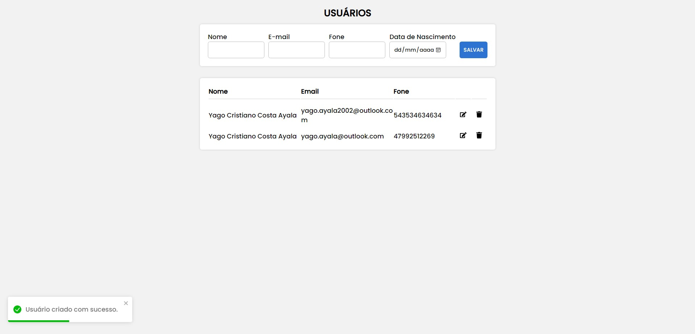

<h2 align="center">
  FullStack Project 
</h2>

## About The Project

## Feito com

Esse projeto foi construido com essas tecnologias:

- React.js
- Node.js
- Express.js
- CSS3
- MySQL
- SQL
- VsCode

## 🛠 Instrução para configuração e instalação

1. Entre na pasta API

2. Instalação: `npm install`

3. Para visualizar o projeto: `npm start`

4. Entre na past FrontEnd

5. Instalação: `npm install`

6. Para visualizar o projeto: `npm start`

Abra [http://localhost:3000](http://localhost:3000) para ver pelo navegador.
